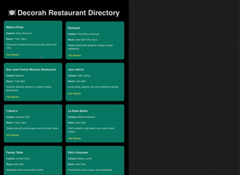

# 🍽️ Decorah Restaurants Directory

A community board web app built with React + Vite to showcase local restaurants in Decorah, Iowa. Created as part of the CodePath Web Development curriculum, this project demonstrates core React concepts including components, props, and styling.

---

## 🎥 Demo

<!-- Replace `demo.gif` with your GIF or video file. For video, use something like:
[Watch Demo on YouTube](https://youtu.be/YOUR_VIDEO_LINK) -->

---

## 🧠 Project Purpose

This project highlights events or resources for a specific community—in this case, the Decorah food scene. The app serves as a visual restaurant directory for locals, students, and visitors looking for great dining options in town.

---

## ✨ Features

- ✅ 10+ unique restaurant cards
- ✅ Clean, responsive grid layout
- ✅ Reusable card component with props
- ✅ Each card includes name, cuisine, hours, description, and website
- ✅ Cohesive visual theme

---

## 🖼️ Screenshots

> You can add additional screenshots here if you'd like

---

## 🛠 Tech Stack

- [React](https://reactjs.org/)
- [Vite](https://vitejs.dev/)
- JavaScript (ES6+)
- HTML5 + CSS3

---

## 📁 File Structure
